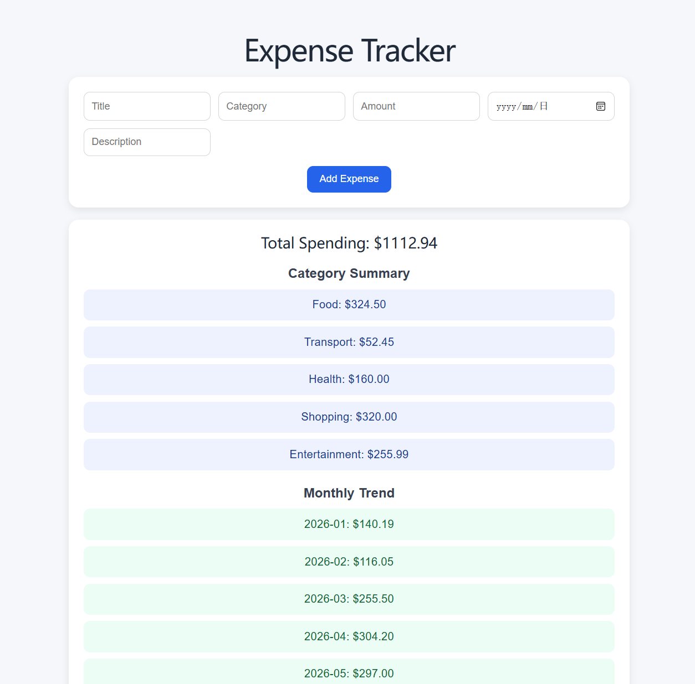

# Expense Tracker (Single Page Web Application)

## Overview

This project is a full-stack single-page web application (SPA) that allows users to manage and analyse their daily expenses. The application supports full CRUD operations and provides insights such as total spending, category-based summaries, and monthly expenditure trends.

The system is designed to simulate a real-world expense tracking tool with smooth interaction and dynamic data updates.

---

## Tech Stack

- **Frontend**: React (Vite)
- **Backend**: Node.js + Express
- **Database**: MySQL
- **Styling**: CSS (inline styling)
- **API Communication**: Fetch API

---

## Key Features

- Add new expense records
- Edit existing expenses
- Delete expenses
- View all expenses dynamically
- Total spending calculation
- Category-based spending summary
- Monthly spending trend analysis
- Single-page application (no page reload)
- Clean and responsive UI

---

## Application Structure
expense-tracker/
├── client/ # React frontend
│ ├── src/
│ │ ├── components/
│ │ │ ├── ExpenseForm.jsx
│ │ │ ├── ExpenseList.jsx
│ │ │ └── Summary.jsx
│ │ ├── App.jsx
│ │ └── main.jsx
│ └── package.json
│
├── server/ # Node.js backend
│ ├── db.js
│ ├── server.js
│ └── package.json
│
├── database/
│ └── expense_tracker.sql
│
└── README.md

---

## How to Run the Project

### 1. Clone the repository

git clone <https://github.com/luczux1/Expense_tracker.git>
cd expense-tracker
### 2. Setup the database

Open MySQL Workbench and run:

SOURCE database/expense_tracker.sql;

### 3. Run the backend server
cd server
npm install
node server.js

### 4. Run the frontend
cd client
npm install
npm run dev

## Business Logic Overview

The application follows a standard CRUD workflow:

Create: Add a new expense via form input
Read: Fetch and display all expenses from the database
Update: Modify an existing expense
Delete: Remove an expense

Additional logic includes:

Aggregating total spending
Grouping expenses by category
Calculating monthly trends

## Challenges and Solutions

One of the main challenges was connecting the frontend React application with the backend API while maintaining a smooth single-page experience. This was solved using asynchronous fetch requests and proper state management.

Another challenge was structuring the project cleanly. This was addressed by separating the application into reusable components such as ExpenseForm, ExpenseList, and Summary.

Handling date formatting and grouping expenses by month also required careful processing of data retrieved from the database.

